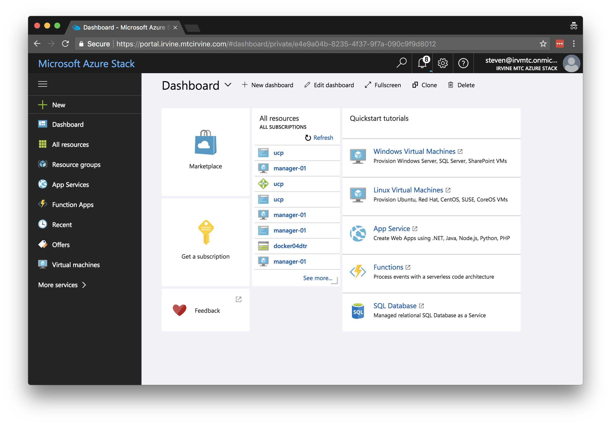
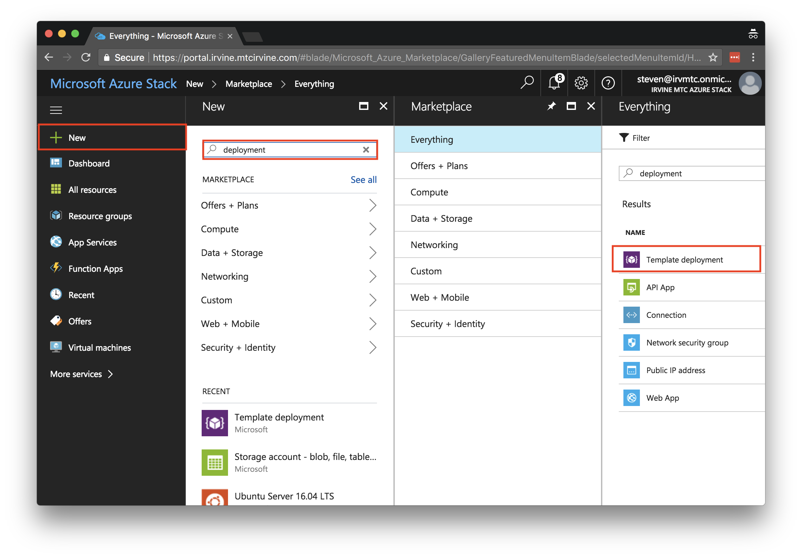
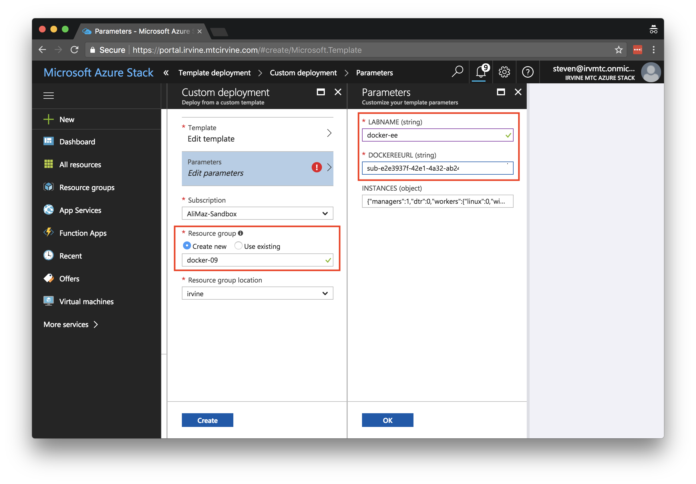

# Docker Enterprise Edition on Azure Stack

This ARM Template deploys the Docker EE platform into an Azure Stack environment. 

## Pre-Requisites
* Properly installed Azure Stack environment
* Docker EE License (or [trial](https://store.docker.com/editions/enterprise/docker-ee-trial) license)

## Usage

### Template Parameters
| Parameter | Description | Example |
| --- | --- | --- |
| `labName` | Provide a short, unique string to identify your deployment. | `docker-ee` |
| `dockerEEURL` | This is the full URL for a subscription located at `store.docker.com`. | `https://storebits.docker.com/ee/m/sub-00000000-0000-0000-0000-000000000000` |

### Installation via Azure Stack Portal

An ARM Template can be deployed entirely via the Portal GUI and requires the least amount of configuration.

1. Begin by logging into the Azure Stack Portal
  

1. Click **+ NEW** in the top left hand corner and search for "`deployment`". Select **Template Deployment**.
  

1. In the Edit Template window, select **Load File** from the top navigation bar. Select the `azuredeploy.single.json` file from this repository to load the file into the editor. Select **Save**
  

1. In the **Parameters** blade, insert a unique parameter for `labName` and paste in your `dockerEEUrl`. Select OK. Choose a name for a new Resource Group and click **Create** to initiate the deployment.
  

### Installation via the Azure Stack CLI
TODO

## Variations

The template comes in two variations:

| Variation | Description | Status |
| --- | --- | --- |
| Single VM | Consists of one VM with UCP and DTR installed together | 0.1 |
| HA | Consists of a 9 node, highly available cluster with separate load balancers for UCP, DTR, and Worker nodes | 0.2 |

## Resources
* [Docker Reference Architecture: Docker EE Best Practices and Design Considerations](https://success.docker.com/article/Docker_Reference_Architecture-_Docker_EE_Best_Practices_and_Design_Considerations)
* [Azure Stack Documentation](https://docs.microsoft.com/en-us/azure/azure-stack/)
